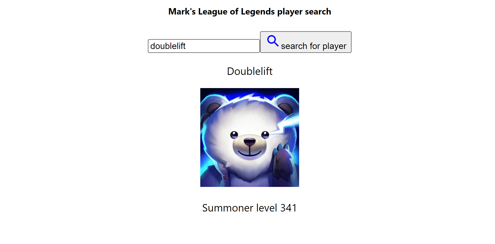

# MSA FRONT-END SUBMISSION League-player-search-

searched for NA legend Peter Yiliang Peng aka Doublelift

searched a summoner who does not exist

A very simple league of legends player search which calls the riot games api to return a player's level and icon using player name.
Used to do msa front end project.

Search for your favourite pro players in the North American scene or ex-pros such as Doublelift.

STEPS
1. cd leaguesearch in the terminal
2. npm install 
3. npm start 
4. search any North American league account

MSA Requirements:
1. Create a new typescript and react web app [DONE]
 
2. Connect this application to a different 3rd party RESTful Web API [DONE]
- connected to riot games developer api

3. Allow users to input information that will be utilized by the API [DONE]
- Input summoner names of players to retrieve their summoner level and profile icon

4. Make use of a UI library like Material-UI. [DONE]
- Used material ui library to style the search bar

5. Utilize source control through GitHub [DONE]
- Used github to comment on activities done during the project
